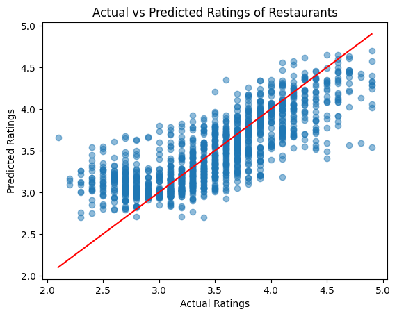

# Restaurant Rating Prediction using Machine Learning

## Project Overview

This project analyzes restaurant data to predict the **aggregate rating of restaurants** using machine learning techniques. The goal is to understand which factors influence restaurant ratings and build a predictive model capable of estimating ratings based on restaurant attributes.

The project includes data cleaning, exploratory data analysis, feature engineering, model training, evaluation, and interpretation of results.

---

## Dataset Description

The dataset contains information about restaurants from various cities around the world. Key attributes include:

- Restaurant location
- Cuisine types
- Price range
- Customer votes
- Cost for two people
- Availability of services such as online delivery and table booking

The **target variable** used for prediction is:

`Aggregate Rating`

Restaurants with no ratings or votes were removed to ensure meaningful analysis.

---

## Project Workflow

The project followed a structured data science pipeline:

### 1. Data Cleaning
- Removed restaurants with zero ratings or votes
- Handled categorical and numerical features
- Removed unnecessary columns

### 2. Exploratory Data Analysis (EDA)
Key observations included:
- Ratings were initially skewed due to many unrated restaurants
- Higher price ranges showed slightly higher average ratings
- Cities with a high number of restaurants tended to have lower average ratings

### 3. Feature Engineering
- Cuisine types were converted into binary indicator variables
- Categorical features were encoded
- Irrelevant text columns were removed

### 4. Model Training
Two models were trained and compared:

- Linear Regression (baseline model)
- Random Forest Regressor

### 5. Model Evaluation
Models were evaluated using:

- R² Score
- Mean Squared Error (MSE)

### 6. Feature Importance Analysis
The Random Forest model was used to determine which features most strongly influenced restaurant ratings.

### 7. Model Validation Experiment
An additional experiment removed geographic features (latitude and longitude) to test whether the model relied heavily on location.

---

## Model Performance

| Model | R² Score | Mean Squared Error |
|------|------|------|
| Linear Regression | ~0.45 | ~0.169 |
| Random Forest (Tuned) | ~0.65 | 0.108 |

The Random Forest model performed significantly better due to its ability to capture nonlinear relationships between features.

---

## Key Insights

- **Customer engagement (votes)** is the strongest predictor of restaurant ratings.
- **Location features** slightly improve predictions but are not essential.
- Restaurants with higher **price ranges** tend to have slightly higher ratings.
- Some **cuisine types** show patterns in customer ratings.
- Nonlinear models perform better than linear models for this dataset.

---

## Visualization

The model predictions were evaluated using an **Actual vs Predicted Ratings plot**, which showed that most predictions cluster near the ideal prediction line, indicating good model performance.

---

## Technologies Used

- Python
- Pandas
- NumPy
- Matplotlib
- Scikit-learn
- Jupyter Notebook

---

## Author

Divyanshu Rawat 